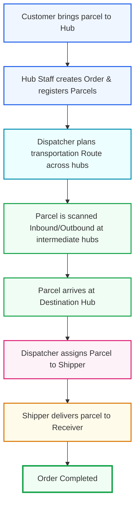

# Parcel Flow Frontend (Next.js Application)

[](https://nextjs.org/)
[](https://react.dev/)
[](https://redux-toolkit.js.org/)
[](https://www.typescriptlang.org/)
[](https://mswjs.io/)

> **Parcel Flow** is an enterprise-grade logistics and parcel transportation tracking management system. Inspired by modern logistics providers (such as DHL, FedEx, UPS, GHN, and GHTK), the application simulates a real-world supply chain operation from first-mile hub intake through route planning, intermediate hub sorting, to last-mile shipper assignment and final delivery confirmation.

---

## 📌 Table of Contents

- [About the Project](#-about-the-project)
- [Core Business Flow](#-core-business-flow)
- [Tech Stack](#-tech-stack)
- [Project Architecture & Directory Structure](#-project-architecture--directory-structure)
- [Getting Started & Local Development](#-getting-started--local-development)
- [State Management & API Layer Guidelines](#-state-management--api-layer-guidelines)
- [Styling & Design System](#-styling--design-system)
- [Roles & Permissions](#-roles--permissions)
- [MVP Page Inventory](#-mvp-page-inventory)

---

## 📖 About the Project

Unlike consumer-first e-commerce delivery systems, **Parcel Flow** is modeled on **hub-centric logistics operations**:
1. **No Online Creation by Customers**: Customers do not create orders online. Instead, they bring parcels to a physical Hub.
2. **Staff-Initiated Ingestion**: Hub Staff registers the order and parcel(s) in the system, generating tracking codes.
3. **Optimized Route Planning**: Dispatchers plan transportation paths across multiple intermediate hubs.
4. **Scans & Custody Transfers**: Parcels undergo physical scans (Inbound/Outbound) at each hub to ensure custody accountability.
5. **Last-Mile Shipper Handover**: The destination hub assigns the parcel to a Shipper who performs the delivery and records status updates.
6. **Public Tracking**: Customers can check the shipment timeline without an account using the `order_code` + `sender_phone` (or `receiver_phone`).

---

## 🔄 Core Business Flow



---

## 🛠️ Tech Stack

### Frontend Core
- **Framework**: [Next.js 16](https://nextjs.org/) (App Router)
- **Language**: [TypeScript](https://www.typescriptlang.org/)
- **State Management**: [Redux Toolkit](https://redux-toolkit.js.org/) (Global UI & Auth State) & [TanStack Query v5](https://tanstack.com/query/latest) (Server State & Caching)
- **Forms & Validation**: [React Hook Form](https://react-hook-form.com/) & [Zod](https://zod.dev/)
- **UI & Components**: [Ant Design](https://ant.design/) (Support Elements)
- **Styling**: SCSS Modules (ITCSS-inspired architecture, strict token-based rules)
- **API Mocking**: [Mock Service Worker (MSW) v2](https://mswjs.io/) (Full local API simulation for offline/decoupled development)
- **Real-Time Integration**: WebSocket over STOMP protocol (Live operations, dashboard state, and tracking maps)

### Backend (Reference)
- **Framework**: Spring Boot (Java 21) & Maven
- **Database**: MySQL
- **Real-time Engine**: WebSocket STOMP
- **Security**: Spring Security & JWT

---

## 📂 Project Architecture & Directory Structure

This project follows a strict **Feature-Based Architecture**. Global folders like `components/`, `services/`, or `hooks/` are forbidden to prevent scalability bottlenecks. Everything must belong to a dedicated feature module or a generic `shared/` layer.

```
src/
├── app/                  # Next.js App Router (Layouts, pages, route groups)
│   ├── (auth)/           # Authentication route group (/login)
│   ├── (dashboard)/      # Admin, Hub Staff, and Dispatcher dashboard routes
│   ├── (public)/         # Public landing page & tracking tools (No login required)
│   └── (shipper)/        # Mobile-optimized routes for shipper operations
├── config/               # Centralized configuration (env variables, RBAC mappings)
├── features/             # Feature-specific modules (Self-contained encapsulation)
│   ├── auth/             # Login, authentication status, contexts
│   └── tracking/         # Public search, package timelines, event feeds
│       ├── api/          # Feature-specific API queries/mutations
│       ├── components/   # Feature-scoped UI components (e.g., TrackingTimeline)
│       ├── hooks/        # Feature-scoped React hooks
│       ├── mocks/        # Mock Service Worker local endpoint handlers
│       └── schemas/      # Zod validation schemas
├── mocks/                # Global MSW configuration (Browser worker registration & general handlers)
├── realtime/             # WebSocket/STOMP connection setup & listeners
├── store/                # Redux Toolkit global store configuration
├── styles/               # ITCSS-style global SCSS architecture (Settings, tools, themes, utility layers)
├── types/                # Core domain types & global type declarations
└── shared/               # Truly reusable cross-feature UI elements & utilities
    ├── api/              # Centralized HTTP Client
    └── components/       # Global atoms (Buttons, Modals, Loaders, Empty States)
```

---

## 🚀 Getting Started & Local Development

### 1. Prerequisites
- **Node.js**: `^20.x` or later
- **Package Manager**: `npm` (or `pnpm`/`yarn`)

### 2. Environment Variables Configuration
Create a `.env.local` file in the root directory (based on `.env.local` defaults):

```env
# Enable Mock Service Worker (MSW) locally in development (true/false)
NEXT_PUBLIC_ENABLE_MSW=true

# Centralized API prefix and backend service URL
NEXT_PUBLIC_API_BASE_URL=http://localhost:8080
NEXT_PUBLIC_API_PREFIX=/api
```

### 3. Installation
Install the project dependencies:
```bash
npm install
# or
pnpm install
```

### 4. Running the Development Server
To launch the Next.js development server with auto-reloading and active MSW mock endpoints:
```bash
npm run dev
# or
pnpm dev
```
Open [http://localhost:3000](http://localhost:3000) in your web browser.

---

## ⚡ State Management & API Layer Guidelines

To maintain code cleanliness, the application enforces the following structural standards:

1. **Centralized HTTP Client**: All requests go through the shared client located in `shared/api/http-client.ts`.
2. **Granular API Files**: Feature API folders should consist of individual files per endpoint (e.g., `create-order.api.ts`, `get-orders.api.ts`). Avoid creating monolithic api files.
3. **No UI Transitions in API Layer**: API functions must only send requests and return strictly typed DTO responses. They are not allowed to manipulate the Redux store or React Query cache directly.
4. **Data Mutators**: All cache invalidations and mutations belong in custom React hooks (e.g., `useCreateOrderMutation.ts`), preserving separation of concerns.

---

## 🎨 Styling & Design System

The application relies on an **ITCSS-inspired hybrid SCSS module architecture** for visual control:
- **No Inline Utility Overuse**: Styling is driven by SCSS modules (`Component.module.scss`) mapped to semantic CSS custom properties.
- **Strict Color Tokens**: Hardcoded HEX/RGB values are forbidden in SCSS modules. Always reference CSS variables:
  ```scss
  /* Bad */
  color: #2563EB;
  
  /* Good */
  color: var(--color-primary);
  ```
- **Dark Mode Support**: The application detects system preference or user manual toggle and sets the `data-theme` attribute on the HTML root element (`light` / `dark`).

---

## 👥 Roles & Permissions

| Role | Access | Core Operations |
| :--- | :--- | :--- |
| **Public Customer** | Public | View landing page, track order status via public code. |
| **Admin** | Internal | Full system access: User, Hub, Route, Order, and Parcel management. |
| **Hub Staff** | Internal | Create orders & parcels, execute Inbound/Outbound scans. |
| **Dispatcher** | Internal | Design route plans & steps, assign deliveries to drivers. |
| **Shipper** | Shipper App | Mobile-optimized viewport to view tasks and confirm deliveries. |

---

## 📋 MVP Page Inventory

The frontend is divided into targeted zones using Next.js route groups:

### 🌐 Public Pages
- `PAGE-PUBLIC-001`: Landing Page (`/`)
- `PAGE-PUBLIC-002`: Tracking Page (`/tracking`)
- `PAGE-PUBLIC-003`: Tracking Result (`/tracking/result`)

### 🔐 Authentication
- `PAGE-AUTH-001`: Login Screen (`/login`)

### 📊 Logistics Dashboard
- `PAGE-DASH-001`: Dashboard Overview (`/dashboard`)
- `PAGE-USER-001` / `002`: User List & Profile Detail (`/dashboard/users`, `/dashboard/users/[id]`)
- `PAGE-HUB-001` / `002`: Hub Inventory & Hub Details (`/dashboard/hubs`, `/dashboard/hubs/[id]`)
- `PAGE-ORDER-001` / `002` / `003`: Order Overview, Form Intake, Details (`/dashboard/orders`, `/dashboard/orders/create`, `/dashboard/orders/[id]`)
- `PAGE-PARCEL-001` / `002` / `003`: Parcel List, Details, Hub Scan Terminal (`/dashboard/parcels`, `/dashboard/parcels/[id]`, `/dashboard/parcels/scan`)
- `PAGE-ROUTE-001` / `002`: Route Plan list & Route Steps Designer (`/dashboard/routes`, `/dashboard/routes/[id]`)
- `PAGE-DELIVERY-001` / `002`: Driver Assignments list & Assign Form (`/dashboard/delivery`, `/dashboard/delivery/[id]`)

### 🛵 Shipper Workspace
- `PAGE-SHIPPER-001` / `002`: My Delivery Assignments list & Update Delivery Status (`/shipper/assignments`, `/shipper/assignments/[id]`)
